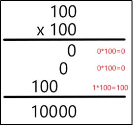
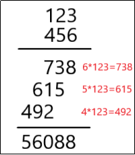

乘法计算
时间限制： 3000MS
内存限制： 589824KB
题目描述：
小程今年读小学了，刚学了乘法计算，需要按位一步步才能算出来。他突发奇想，记下了列出来的式子（见样例说明）里每个数字有多少个，让你根据数字出现次数反推两个乘数。（此题保证30%的数据，乘积不超过100，100%的数据两个乘数都∈[0，999]，保证有解）

输入描述
仅一行，包含10个用空格隔开的整数，为每个数字的出现次数（从0开始）。

输出描述
仅一行，包含两个整数a和b，分别表示两个乘数，用空格隔开。（如果有多组解，输出第一个乘数最小的那组解）

样例输入
12 4 0 0 0 0 0 0 0 0
样例输出
100 100

提示
输入样例2

1 2 2 2 2 3 3 1 3 1

输出样例2

123 456

样例说明

样例一：

样例二：
